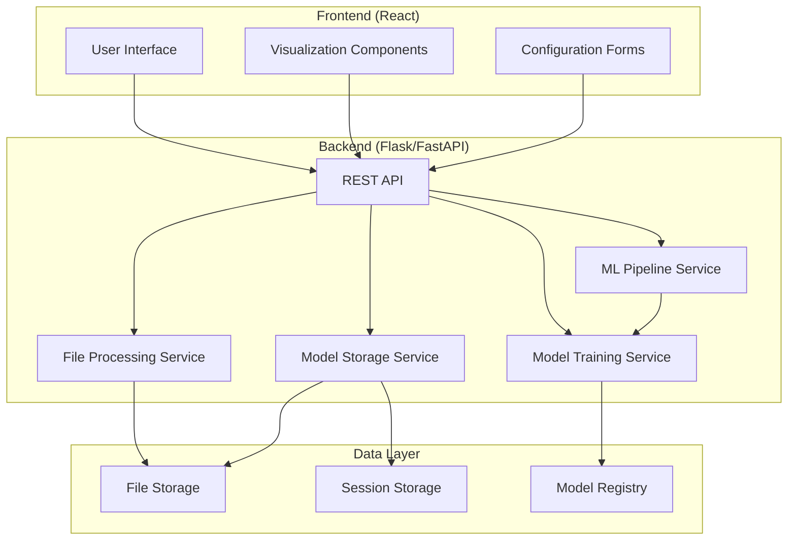

# Design Document: ML Training Platform

## Overview

The ML Training Platform is a web-based application that democratizes machine learning by providing an intuitive interface for users to train models without coding. The platform follows a modern web architecture with a Python backend leveraging scikit-learn for ML capabilities and a React frontend for interactive user experiences.

The system is designed around a pipeline pattern that guides users through a step-by-step workflow: dataset upload → task configuration → algorithm selection → hyperparameter tuning → model training → evaluation → comparison → export. This approach ensures reproducible results while maintaining simplicity for beginner users.

## Architecture

The platform uses a three-tier architecture:

### Frontend Layer (React)

- **React SPA**: Single-page application providing responsive user interface
- **Chart.js/Recharts**: Data visualization for metrics and model comparisons
- **File Upload Component**: Drag-and-drop CSV upload with validation
- **Configuration Forms**: Dynamic forms for algorithm and hyperparameter selection
- **Progress Tracking**: Real-time training progress and status updates

### Backend Layer (Flask/FastAPI)

- **REST API**: RESTful endpoints for all platform operations
- **ML Pipeline Service**: Orchestrates the complete ML workflow
- **Model Training Service**: Handles scikit-learn model training and evaluation
- **File Processing Service**: CSV parsing, validation, and preprocessing
- **Model Storage Service**: Manages trained model persistence and retrieval

### Data Layer

- **File Storage**: Local filesystem for CSV datasets and model files
- **Session Storage**: In-memory storage for training sessions and temporary data
- **Model Registry**: Organized storage for trained models with metadata



## Components and Interfaces

### Core Components

#### DatasetManager

**Purpose**: Handles CSV file upload, validation, and preprocessing
**Key Methods**:

- `upload_dataset(file)`: Validates and stores uploaded CSV files
- `preview_dataset(dataset_id)`: Returns sample rows and column information
- `get_column_types(dataset_id)`: Automatically detects data types
- `preprocess_data(dataset_id, config)`: Applies preprocessing transformations

#### ModelTrainer

**Purpose**: Orchestrates model training using scikit-learn algorithms
**Key Methods**:

- `train_model(dataset_id, algorithm, hyperparams)`: Trains model with specified configuration
- `get_training_progress(session_id)`: Returns current training status
- `evaluate_model(model_id)`: Calculates performance metrics
- `save_model(model_id)`: Persists trained model to storage

#### MetricsCalculator

**Purpose**: Computes and formats performance metrics for different ML tasks
**Key Methods**:

- `calculate_classification_metrics(y_true, y_pred)`: Returns accuracy, F1, precision, recall
- `calculate_regression_metrics(y_true, y_pred)`: Returns R², MSE, MAE
- `calculate_clustering_metrics(X, labels)`: Returns silhouette score, inertia
- `format_metrics_for_display(metrics)`: Formats metrics for frontend consumption

#### ModelComparator

**Purpose**: Enables side-by-side comparison of multiple trained models
**Key Methods**:

- `compare_models(model_ids)`: Returns comparison data structure
- `generate_comparison_charts(models)`: Creates visualization data
- `rank_models(models, primary_metric)`: Orders models by performance

### API Interfaces

#### Dataset Endpoints

```
POST /api/datasets/upload
GET /api/datasets/{id}/preview
GET /api/datasets/{id}/columns
POST /api/datasets/{id}/preprocess
```

#### Training Endpoints

```
POST /api/training/start
GET /api/training/{session_id}/status
GET /api/training/{session_id}/progress
POST /api/training/{session_id}/stop
```

#### Model Endpoints

```
GET /api/models/{id}
GET /api/models/{id}/metrics
GET /api/models/{id}/download
POST /api/models/compare
DELETE /api/models/{id}
```

#### Configuration Endpoints

```
GET /api/algorithms/{task_type}
GET /api/algorithms/{algorithm}/hyperparameters
GET /api/algorithms/{algorithm}/defaults
```

## Data Models

### Dataset Model

```python
class Dataset:
    id: str
    filename: str
    upload_timestamp: datetime
    file_path: str
    columns: List[ColumnInfo]
    row_count: int
    file_size: int
    preprocessing_config: Optional[PreprocessingConfig]
```

### Model Model

```python
class TrainedModel:
    id: str
    dataset_id: str
    algorithm: str
    hyperparameters: Dict[str, Any]
    training_timestamp: datetime
    training_duration: float
    metrics: Dict[str, float]
    model_file_path: str
    random_seed: int
    status: ModelStatus  # TRAINING, COMPLETED, FAILED
```

### Training Session

```python
class TrainingSession:
    id: str
    dataset_id: str
    algorithm: str
    hyperparameters: Dict[str, Any]
    status: SessionStatus  # PENDING, RUNNING, COMPLETED, FAILED
    progress_percentage: float
    start_time: datetime
    estimated_completion: Optional[datetime]
    error_message: Optional[str]
```

### Algorithm Configuration

```python
class AlgorithmConfig:
    name: str
    task_types: List[TaskType]  # CLASSIFICATION, REGRESSION, CLUSTERING
    hyperparameters: List[HyperparameterDef]
    default_values: Dict[str, Any]
    description: str
```
